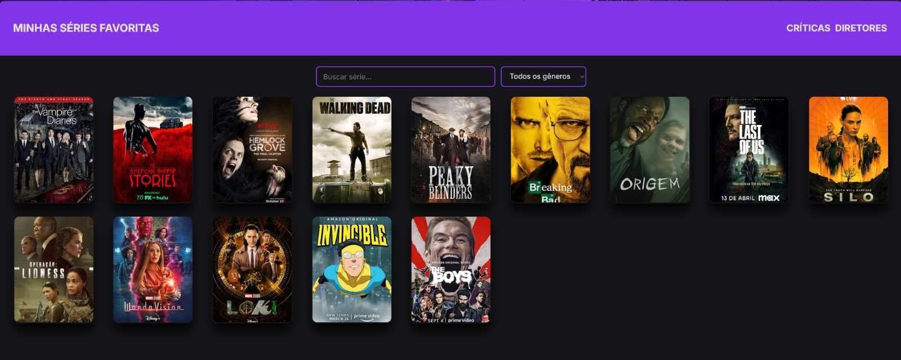

# 🎬 Minhas Séries Favoritas

Galeria com as séries que eu mais gosto, com página de detalhe para cada uma, busca e filtro por gênero.

🔗 **Acesse:** https://my-favorites-series.vercel.app



## Funcionalidades

- Galeria com as capas de 14 séries
- Página de detalhe para cada série, com gênero, sinopse, temporadas, ano e nota no IMDB
- Busca pelo nome da série, que funciona com ou sem acento ("invencivel" encontra "Invencível")
- Filtro por gênero, que pode ser combinado com a busca
- Layout responsivo, do celular ao desktop

## Antes e depois

Este foi o meu primeiro projeto, feito em 2025 só com HTML e CSS. Cada série tinha a sua própria página, então
eram 14 arquivos HTML praticamente iguais, onde só mudava o conteúdo. Para colocar uma série nova, eu precisava
criar mais um arquivo e mexer na galeria à mão.

Em 2026 eu refiz o projeto em React. Hoje os dados das séries ficam em uma lista só, e **um** componente monta a
página de qualquer série a partir do endereço (`/serie/loki`, `/serie/silo`...). Para adicionar uma série nova,
basta acrescentar uma entrada na lista. Aproveitei para incluir o que a versão antiga não tinha: busca e filtro.

A primeira versão está guardada na pasta [`legacy/`](legacy/), e o CSS dela continua sendo a base do visual.

## Tecnologias

- React + TypeScript
- Vite
- React Router
- CSS puro (flex-box e grid)
- Deploy na Vercel

## O que aprendi

- **Separar os dados da tela:** criar um `type` para a série me fez pensar no formato de cada informação.
  O gênero virou uma lista para poder filtrar, e a nota virou número para poder ordenar.
- **Componentes e listas:** com `.map()`, um único `SerieCard` substitui as 14 capas escritas à mão. Também
  entendi para que serve o `key` e por que ele precisa ser único.
- **Estado com `useState`:** a busca e o filtro guardam o que a pessoa digitou ou escolheu, e a galeria se
  atualiza sozinha a cada mudança.
- **Rotas:** com o React Router, o endereço da página (`:slug`) diz qual série mostrar. Também aprendi que a
  Vercel precisa de um `vercel.json` para não dar erro 404 quando alguém abre esse endereço direto.
- **TypeScript como rede de segurança:** ele avisou na hora quando eu usei um campo que não existia. Mas ele
  não confere se uma imagem existe de verdade, e isso eu aprendi testando.

## Como rodar no seu computador

```bash
npm install
npm run dev
```
